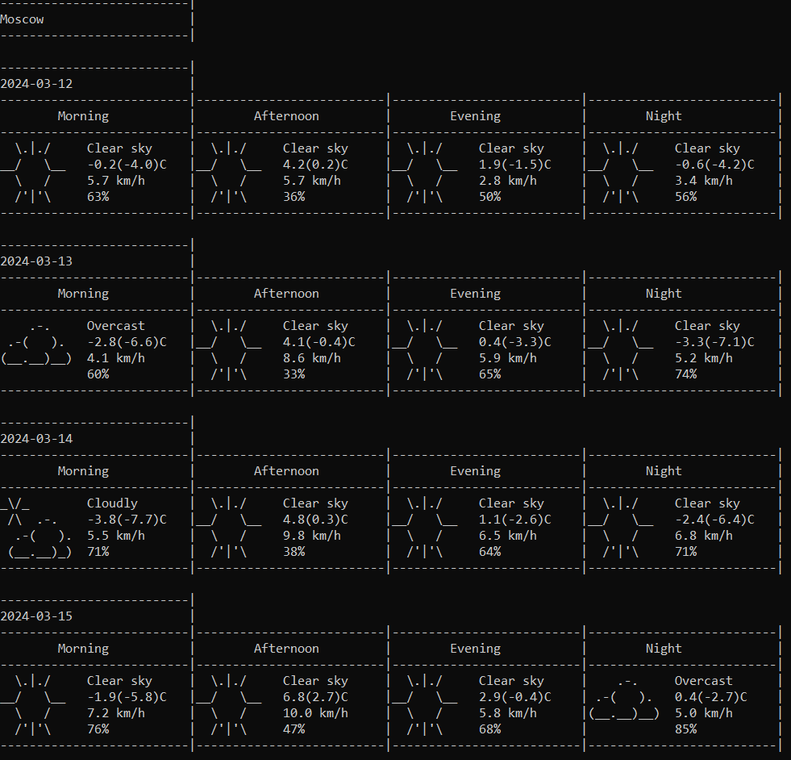

## Общее

Прогноз погоды.

Реализовано консольное приложение, отображающие прогноз погоды для выбранного списка городов, используя сторонние библиотеки.

## Источник данных

- [Open-Meteo](https://open-meteo.com/en/docs#latitude=59.94&longitude=30.31&hourly=temperature_2m&forecast_days=16) для прогноза
- [Api-Ninjas](https://api-ninjas.com/api/city) для определения координат по названию города

## Функционал

 - Отображение прогноза погоды на несколько дней вперед (значение по умолчанию задается конфигом)
 - Обновление с некоторой частотой (задается конфигом)
 - Переключение между городами с помощью клавиш "n", "p"
 - Конец работы программы по нажатию Esc
 - Увеличение\уменьшение количества дней прогноза по нажатие клавиш "+", "-"

Список городов, частота обновления, количество дней прогноза определены в конфиге (в формате json)

## Отображение

Образец визуализации:

## Реализация

В качестве библиотеки для [HTTP-запросов](https://en.wikipedia.org/wiki/HTTP) была использована [curl](https://github.com/curl/curl)
